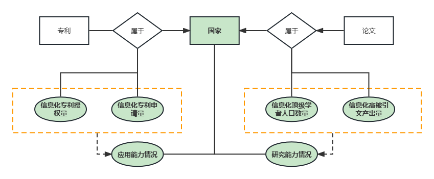

# PKU-IM-Java2022
北京大学信息管理系 面向对象程序设计Java 2022秋 期末大作业

Final project for Java in Dept. IM, Peking University

## 任务1：统计四个二级指标

- D-111和D112为论文数量的统计，在GenData.ArticleSolution中，并存储为两个csv

- D-121和D-122为专利数量的统计，在GenData.PatentSolution中，并存储为两个csv

## 任务2：计算指标分数

- 虽然这个任务在使用excel可能只要两秒钟，但是考虑到没有特殊说明可以使用其他工具，并且是java课程，计算写在了GenData.MinMaxScaler中

## 任务3：构建数据库

- MySQL 8.0.30
- 构建数据库使用Navicat而不是使用JAVA运行SQL语句
- ER图
  
  - 绿色底色的是数据库中实际存储的实体和属性
  - 由于专利和论文的属性并不需要在系统中展示，故略去；并且指标的计算也并不需要系统自动根据存储在数据库中的专利和论文数据计算
- 表结构
  - 考虑到指标数量多、国家数量少、年份少，数据量小，为增删改查方便，满足基本范式即可。故构建单表如下：
  - 

- 存入数据，并转储为java-2022.sql

## 任务4：数据可视化

- Entity：按照表结构，规定每一年的国家指标为一个实体，由COUNTRY和YEAR属性唯一确定
- DAO：创建读取数据的函数
- Serverlet：IndexServerlet向页面传输所有数据（json化）
- jsp：使用echarts展示数据，并且按照select的指标进行数值切换

可以切换指标

## 任务5：数据增删改查

